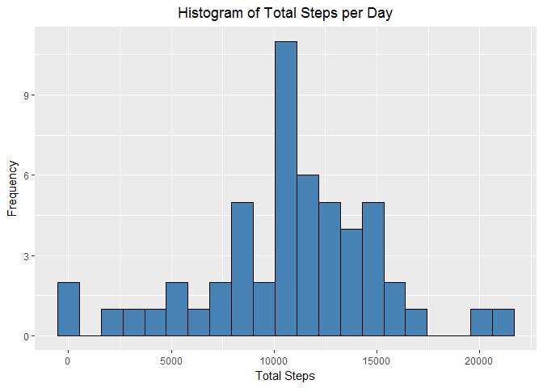
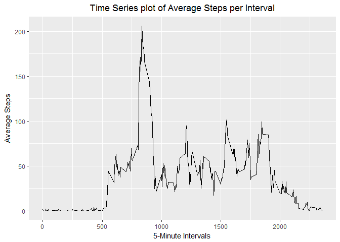
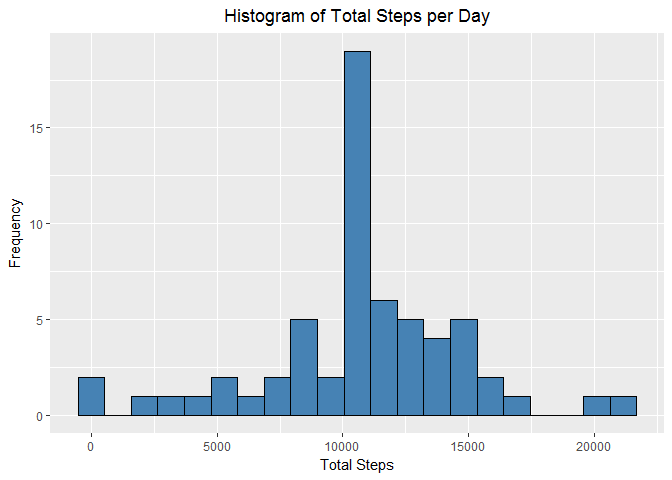
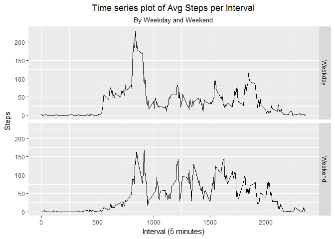

```r
library(ggplot2)
```

```
## Warning: package 'ggplot2' was built under R version 3.4.3
```
## Loading and preprocessing the data
### 1. function to download the file from URL and unzip the file

```r
inputData <- function(url="", file="default.csv", method = NULL){  
  if(!file.exists(file)){  
            temp <- tempfile()  
            download.file(url, temp, method = method)  
            unzip(temp, file)  
            unlink(temp)  
        }else{  
            message("Data already downloaded...")  
        }  
}  

url <-"https://d396qusza40orc.cloudfront.net/repdata%2Fdata%2Factivity.zip"
```
### 2. download the file

```r
inputData(url, "activity.csv")
```

```
## Data already downloaded...
```
### 3. import the csv as Dataframe

```r
amData <- read.csv("activity.csv")
amData[,2] <- as.Date(amData[,2])
```

## What is mean total number of steps taken per day?

```r
stepsByDate <- aggregate(steps~date, data = amData, sum, na.rm = TRUE)

binsize <- diff(range(stepsByDate$steps))/20
ggplot(stepsByDate, aes(x = steps)) +
        geom_histogram(binwidth = binsize, fill = "steelblue", color = "black") +
        ggtitle("Histogram of Total Steps per Day") +
        theme(plot.title = element_text(hjust = 0.5)) +
        xlab("Total Steps") + 
        ylab("Frequency")
```

<!-- -->

```r
meanSteps <- mean(stepsByDate$steps)
medianSteps <- median(stepsByDate$steps)
```
Mean of Total number of steps taken per day is 1.0766189\times 10^{4}.  
Median of Total number of steps taken per day is 10765.  

## What is the average daily activity pattern?

```r
activityPattern <- aggregate(steps~interval, data = amData, FUN=mean, na.rm = TRUE)
ggplot(activityPattern, aes(x = interval, y = steps)) +
        geom_line() +
        ggtitle("Time Series plot of Average Steps per Interval") +
        theme(plot.title = element_text(hjust = 0.5)) +
        xlab("5-Minute Intervals") + 
        ylab("Average Steps")
```

<!-- -->
  
Which 5-minute interval, on average across all the days in the dataset, contains the maximum number of steps?  

```r
maxSteps <- activityPattern[which.max(activityPattern$steps),]
```
Interval is 835  
Maximum steps are 206.1698113  


## Imputing missing values
### 1. Calculate and report the total number of missing values in the dataset

```r
naRows <- nrow(amData[is.na(amData$steps),])
```
The total number of rows with NA values are 2304.  

### 2. Strategy for filling NA values
### 3. Create a new dataset that is equal to the original dataset but with the missing data filled in.

```r
newDataset <- merge(amData, activityPattern, by = 'interval', all.y = FALSE)
newDataset[is.na(newDataset$steps.x),2] <- newDataset[is.na(newDataset$steps.x),4]
newDataset <- newDataset[,c(1,2,3)]
names(newDataset)[2] <- "steps"
```

### 4. Make a histogram of the total number of steps taken each day

```r
newstepsByDate <- aggregate(steps~date, data = newDataset, sum, na.rm = TRUE)

binsize <- diff(range(newstepsByDate$steps))/20
ggplot(newstepsByDate, aes(x = steps)) +
        geom_histogram(binwidth = binsize, fill = "steelblue", color = "black") +
        ggtitle("Histogram of Total Steps per Day") +
        theme(plot.title = element_text(hjust = 0.5)) +
        xlab("Total Steps") + 
        ylab("Frequency")
```

<!-- -->

```r
newMeanSteps <- mean(newstepsByDate$steps)
newMedianSteps <- median(newstepsByDate$steps)
```
Mean of Total number of steps taken per day is 1.0766189\times 10^{4} against previous 1.0766189\times 10^{4}.    
Median of Total number of steps taken per day is 1.0766189\times 10^{4} against previous 10765.   

## Are there differences in activity patterns between weekdays and weekends?

```r
newDataset$day <- weekdays(newDataset$date)
newDataset$byday[newDataset$day %in% c("Saturday", "Sunday")] <- "Weekend"
newDataset$byday[is.na(newDataset$byday)] <- "Weekday"
datasetInterval <- aggregate(steps~interval + byday, data=newDataset, mean)
ggplot(datasetInterval, aes(x=interval, y=steps)) +
        geom_line() +
        facet_grid(byday~.)+
        ggtitle("Time series plot of Avg Steps per Interval",
                subtitle = "By Weekday and Weekend") +
        theme(plot.title = element_text(hjust = 0.5), plot.subtitle = element_text(hjust = 0.5)) +
        xlab("Interval (5 minutes)") + 
        ylab("Steps")
```

<!-- -->

